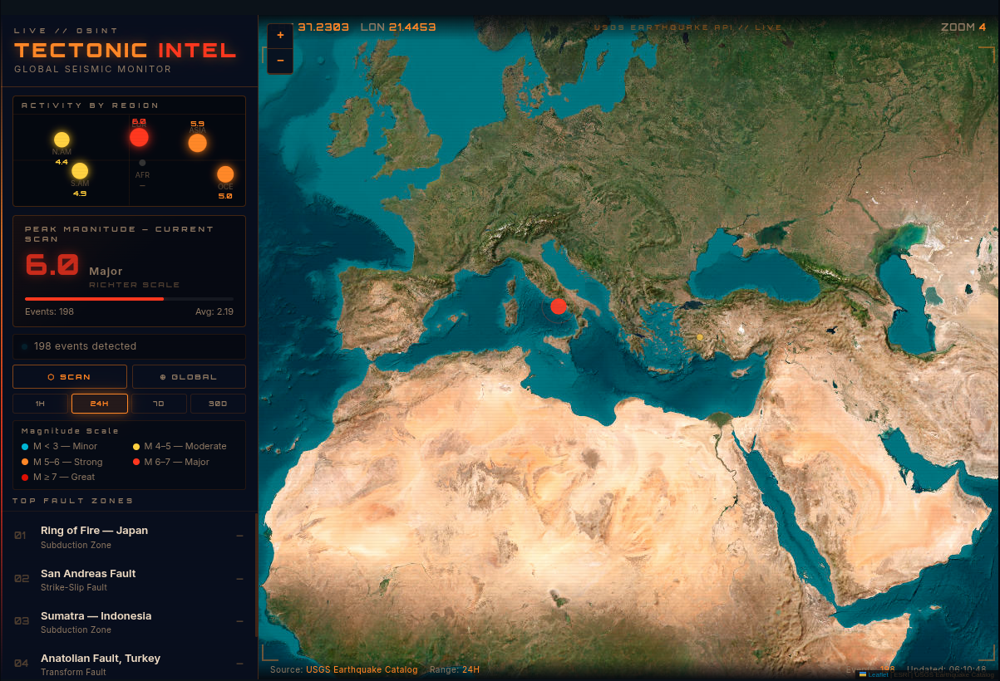
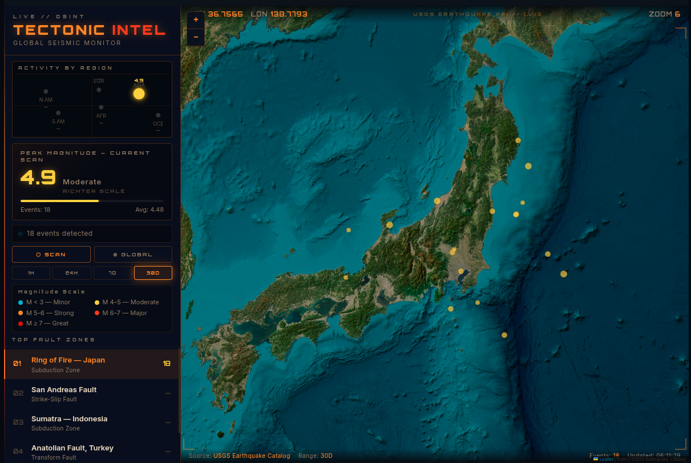

# Tectonic Intel // OSINT tool

A high-fidelity, real-time geological monitoring dashboard built for **OSINT (Open Source Intelligence)** enthusiasts and systemic simulation fans. This terminal connects directly to the **USGS (U.S. Geological Survey)** API to visualize global seismic activity with a tactical, "bunker-style" interface.

---

## 🚀 Live Demo

Access the operational terminal directly in your browser:

[](https://alga93.itch.io/tectonic-intel)

---

## 📡 Live Intelligence
The terminal filters global tectonic noise to deliver a tactical view of the planet’s most volatile fault zones.

### Regional Scanning: Italy & Mediterranean
Monitoring seismic activity across complex European fault lines.


### High-Alert Zone: Japan & The Ring of Fire
Real-time tracking of the Pacific's most active subduction zones.


---

## 🛠️ Technical Features

* **Live USGS Integration:** Fetches real-time GeoJSON data from the USGS Earthquake Catalog.
* **Dynamic Magnitude Gauges:** An interactive Richter scale interface that reacts to event severity (Micro to Great).
* **OSINT Analytics:** Tracks magnitude, depth, and Tsunami warnings with precise coordinate mapping.
* **Temporal Scanning:** Adjustable time ranges (1H, 24H, 7D, 30D) to analyze seismic trends over time.
* **High-Contrast HUD:** Optimized "Dark Grid" UI for focus and immersion, built with Vanilla JS and Leaflet.js.

## 💻 Development Environment

This project was developed and tested on **Linux** using **VSCode**.
* **Engine:** HTML5 / CSS3 / Vanilla JavaScript
* **Map Engine:** Leaflet.js (ESRI World Imagery)
* **Data Source:** USGS Earthquake Hazards Program API

## Technologies Used


---

## 🚀 How to Run

1. Clone the repository:
   ```bash
   git clone [https://github.com/andreluizgreboge/tectonic-intel.git](https://github.com/andreluizgreboge/tectonic-intel.git)
   ```
   
2. Open index.html in any modern web browser.

3. Select a Fault Zone to begin scanning.

## 📄 License
This tool is for informational and educational purposes only. Data is provided by the USGS.

Developed by Andre Luiz Greboge.

This project is licensed under the MIT License - see the [LICENSE](LICENSE) file for details.


